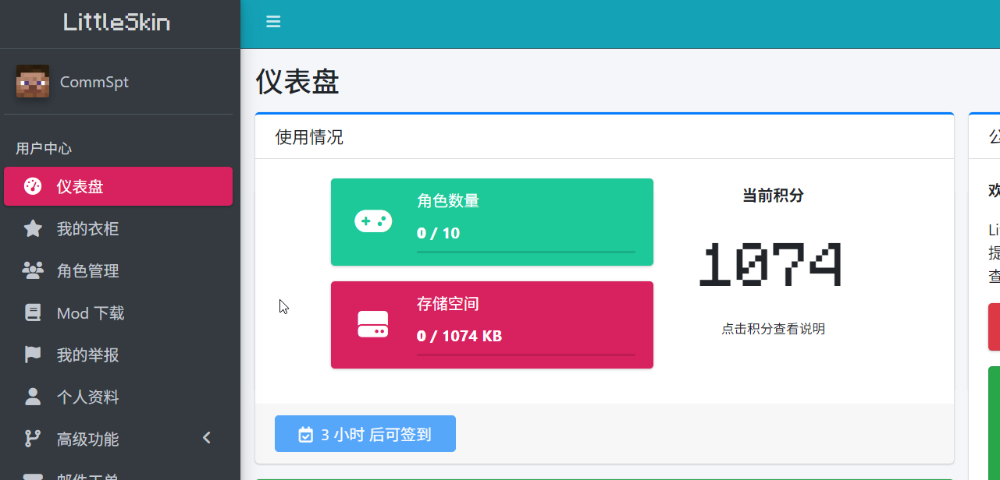
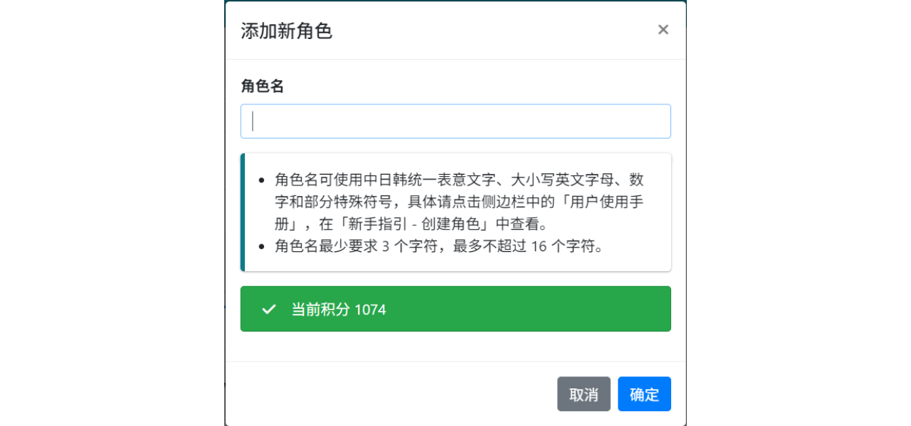

# Create a Character

LittleSkin supports skin Mods that identify players and load textures through character names, so you need to create your game character first to load skins in Minecraft.

::: warning Note
Creating a character costs 100 points, and points will be returned when deleting a character.
Please make sure you have enough points before creating a character, otherwise you will not be able to create a character.
:::

You can create and manage your characters on the <BSSection><FA :icon="faUsers" /> Character Management</BSSection> page in the User Center:

1. Click on <BSSection><FA :icon="faUsers" /> Character Management</BSSection> in the left menu bar of the User Center, and click on <BSButton><FA :icon="faPlus" /> Add New Character</BSButton> on the page that opens.

    

2. Enter your character name in the pop-up window and click the <BSButton>Confirm</BSButton> button:

    ::: tip Tip
    Character names can use Chinese, Japanese, and Korean ideographs, upper and lower case English letters, Arabic numerals, and the following special symbols:

    - Underscore (`_`), hyphen (`-`);
    - Comma (`,`), period (`.`);
    - Square brackets (`[]`), curly braces (`{}`);
    - Plus sign (`+`), equals sign (`=`), caret (`^`).

    The character name length requirement is a minimum of 3 characters, and a maximum of 16 characters.
    :::

    

3. Your first character is now created~

If you want to create more characters in the future, you can also follow the method described in this document.

## Bind Genuine Characters

If you have a genuine Minecraft, you can bind it to your LittleSkin account.

You can find the <BSSection>Genuine Verification & Binding</BSSection> section at the bottom of the <BSSection><FA :icon="faUsers" /> Character Management</BSSection> page (if this section is not available, please try refreshing the page), and click the <BSButton>Verify and Bind</BSButton> button below. The page will then redirect to Microsoft's OAuth login page, where you can log in with your Microsoft account and authorize to complete the binding.

After binding, a character with the same name as your genuine Minecraft account will automatically be added to your account (if there is a character with the same name on the site, that character will be forcibly transferred to your account), and you can receive point rewards. At the same time, if you need to retrieve the latest genuine character name or need to rebuild the character after deleting it, you can click the <BSButton>Update Bound Character</BSButton> button below to complete.

Each LittleSkin account can only bind one genuine Minecraft account, and it is not allowed to unbind the genuine Minecraft account after binding, unless the LittleSkin account is deleted.

::: warning Note
After binding a genuine Minecraft account, your Microsoft account will also be bound, and it cannot be unbound like the genuine Minecraft account, unless the LittleSkin account is deleted. Please consider carefully before binding.
:::
