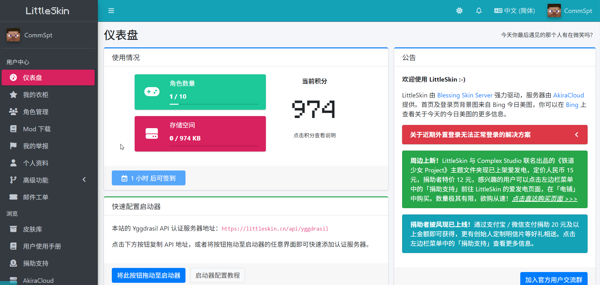
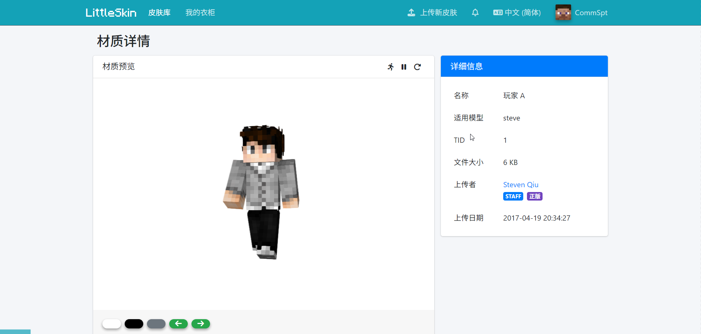
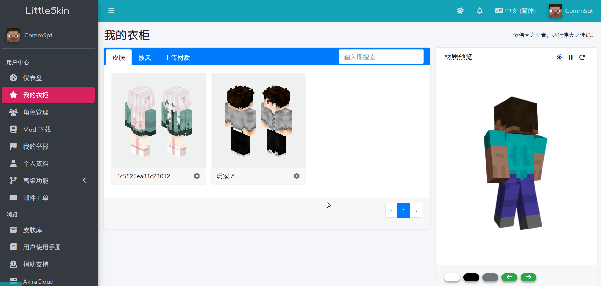

# Setting Textures

After creating your character, you can apply textures to it.

You can upload your own textures, or directly add textures from the skin library to your wardrobe.

## Uploading Textures

If you own the source file of a texture, you can upload it to the skin library. Only textures in the skin library can be added to your wardrobe.

LittleSkin supports uploading the following textures

- Single-layer skins (size 64\*32 or its integer multiples)
- Double-layer skins (size 64\*64 or its integer multiples)
- 64\*32 capes (but not 22\*17 capes), the texture of the elytra should be directly drawn on the cape.

All texture files should be PNG format images.

::: tip About PNG Format
As a format with a transparency channel, PNG refers not just to the file name extension `.png`, but more importantly to the specifications of the PNG format.

Simply renaming other formats' pictures will result in them not being usable.
:::

::: tip About Credits
Uploading textures requires spending credits, and the amount of credits spent is calculated based on the file size of the texture. Public textures, once collected by others, can earn you reward credits.

For public textures, each KB of storage space costs 1 credit; for private textures, each KB of storage space costs 20 credits. Credits will be refunded when textures are deleted.

Public textures earn 10 credits for each collection. If a wardrobe collection is deleted, 10 credits will be deducted.
:::

::: warning Note
The estimated credit consumption shown on the texture upload page is for reference only, the actual credit consumption will be calculated based on the actual size of the texture file.
:::

1. Enter <BSSection><FA :icon="faArchive"/> Skin Library</BSSection>, click on <BSButton style="background-color: #17a2b8;"><FA :icon="faUpload"/> Upload New Skin</BSButton> in the top menu bar of the page.

2. In the opened page, set the texture name, select the texture type, choose the texture file, decide whether to set it as private.
   You can view the preview of your texture on the right.
   After setting the texture information, click the <BSButton style="background-color: #28a745;">Confirm Upload</BSButton> button.

   ::: danger Remember
   LittleSkin does not allow the upload of sensitive textures including but not limited to the following (including controversial textures):

   - **High-definition** sexually sensitive textures
   - Politically sensitive textures
   - Textures violating the laws of Mainland China, Hong Kong SAR, and the USA

   For sensitive textures, you must set them as private upon upload, otherwise, once discovered, the relevant textures will be deleted, and you will be permanently banned by LittleSkin.
   :::

:sparkles: Your texture is now uploaded~

After the texture is uploaded, you will be automatically redirected to the detail page of the texture you just uploaded.

Your uploaded texture will be automatically added to your wardrobe, and you can directly go to the <BSSection><FA :icon="faStar"/> My Wardrobe</BSSection> page to view and set it to your character.

## Adding Textures from the Skin Library to the Wardrobe

If the texture you want to use is already in the skin library, you can directly add it to your wardrobe for use.

::: tip Tip
Each texture added to the wardrobe costs 10 credits. Credits will be refunded when textures are deleted from the wardrobe.
::::

1. Enter the texture detail page, click on <BSButton style="background-color: transparent; color: #007bff; border-color: #007bff;">Add to Wardrobe</BSButton> below the left side of the texture preview.

2. In the pop-up dialog, set the name for the wardrobe item, click <BSButton>Confirm</BSButton>.

:sparkles: The texture has been successfully added to the wardrobe~

After adding, you can also directly set the texture to your character on the texture detail page.

## Setting Textures to Characters

After adding the texture to the wardrobe, you can set the texture to your character.

You can manage wardrobe items and set textures to characters on the <BSSection><FA :icon="faStar"/> My Wardrobe</BSSection> page in the user center.

1. Click on <BSSection><FA :icon="faStar"/> My Wardrobe</BSSection> in the left menu bar of the user center.

2. In the opened page, select the texture category at the upper left <BSSection>Skin</BSSection><BSSection>Cape</BSSection>, choose the texture you want to use, click on <BSButton>Use...</BSButton> below the left side of the texture preview.

3. In the pop-up window, select the character to which you want to set the texture.

:sparkles: The texture has been set to your character~

If you want to change textures in the future or set textures for other characters, you can also follow the methods described in this document.

### Tip: Changing Avatar

You can set the face of the skin in your wardrobe as your avatar on LittleSkin.

Select the <BSSection>Skin</BSSection> category in the wardrobe, click the gear button at the bottom right of the wardrobe item, then click <BSButton>Set as Avatar</BSButton>. The face of the skin will be automatically cropped as the avatar.

